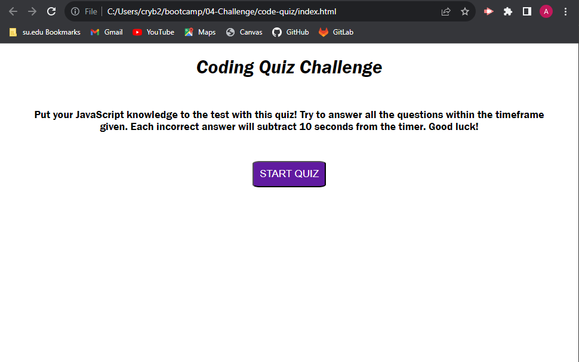

# code-quiz

## Description
For this project, I was responsible for creating a JavaScript quiz. I wrote all HTML, CSS, and JavaScript code. I was able to dive deep into how these languages interact with each other and I became more comfortable with syntax as well as properties specific to each language.

## Usage
Here is a live link:

